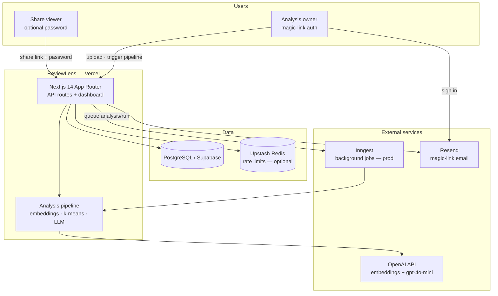
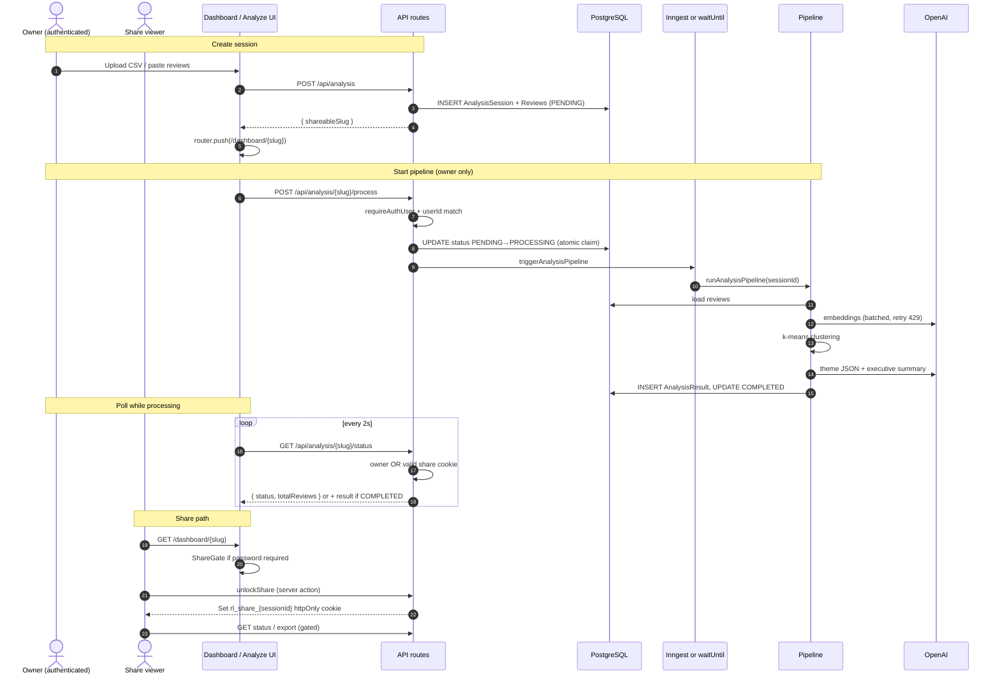
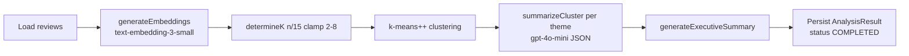

# ReviewLens Architecture

This document describes how ReviewLens is structured, how requests flow through the system, and the main engineering decisions behind the design.

---

## 1. System context (C4 Level 1)

ReviewLens is a Next.js app that ingests customer reviews (CSV or paste), clusters them with embeddings + k-means, summarizes themes with OpenAI, and serves shareable dashboards.



**Trust boundaries**

| Boundary | What crosses it |
|----------|-----------------|
| Browser ↔ Vercel | JWT session cookie (Auth.js), optional `rl_share_{sessionId}` HMAC cookie |
| Vercel ↔ Postgres | Prisma — sessions, reviews, results, auth users |
| Vercel ↔ OpenAI | API key server-side only; embeddings batched 100/review |
| Vercel ↔ Inngest | Event `analysis/run` in production when configured |

---

## 2. Request flow: upload → process → poll → share

### 2.1 Sequence diagram



### 2.2 API authorization matrix

| Endpoint | Owner | Share viewer (valid cookie) | Public |
|----------|-------|----------------------------|--------|
| `POST /api/analysis` | ✓ | ✗ | ✗ |
| `POST /api/analysis/{slug}/process` | ✓ | ✗ | ✗ |
| `GET /api/analysis/{slug}/status` (metadata) | ✓ | ✓ | ✗ |
| `GET /api/analysis/{slug}/status` (full `result`) | ✓ | ✓ | ✗ |
| `GET /api/analysis/{slug}/export` | ✓ | ✓ | ✗ |
| `GET /dashboard/{slug}` | via share gate | via share gate | ✗ (password / expiry) |

Implementation: `lib/share-access.ts` (`checkShareAccess`), `lib/auth-helpers.ts` (`requireAuthUser`), mirrored in status, export, and dashboard page.

---

## 3. Pipeline internals



**Stages** (`features/analysis/pipeline.ts`): `load_reviews` → `embeddings` → `clustering` → `theme_summaries` → `executive_summary`.

**Idempotency**: duplicate `AnalysisResult` insert (`P2002`) exits cleanly — safe for retries. Process route uses `updateMany WHERE status = PENDING` so only one worker claims a session.

---

## 4. Architecture Decision Records

### ADR-001: Share-first collaboration (no team workspaces)

**Status:** Accepted (share-first only; workspace schema removed in RL-013)

**Context:** Recruiters and PMs need a single link to an analysis report. A half-built `Organization` / invite model added scope-creep risk without shipping a real team UX.

**Decision:** Optimize for **shareable slug URLs** with optional password + expiry. Dashboard, status, and export use the same share gate. Magic-link auth identifies the owner. Analyses are scoped to `User.id` only.

**Consequences**

- (+) Demo and interview story stay simple: upload → link → share.
- (+) Security model is one coherent path (owner vs share viewer).
- (+) No dead schema or API surface for interviewers to probe.

---

### ADR-002: Inngest vs `waitUntil`

**Status:** Accepted

**Context:** The analysis pipeline runs 15–90s. Vercel serverless functions terminate when the HTTP response is sent unless work is extended or offloaded.

**Decision** (`lib/jobs/pipeline-trigger.ts`):

| Environment | Behavior |
|-------------|----------|
| Production + Inngest configured | `inngest.send({ name: "analysis/run" })` — worker runs `runAnalysisPipeline` |
| Local dev / Inngest unset | `runAnalysisPipeline` in-process + `waitUntil(promise)` on Vercel |
| Local + `INNGEST_RUN_IN_DEV=1` | Use Inngest path for integration testing |

**Why not Inngest everywhere?** Queuing without a running Inngest worker leaves sessions stuck in `PROCESSING`. Local dev must complete without extra infrastructure.

**Consequences**

- (+) Production gets retries (`retries: 2` on Inngest function) and decoupled execution.
- (+) Local `npm run dev` works out of the box.
- (−) Two code paths to test — covered by pipeline unit tests + e2e mocks.

---

### ADR-003: k-means k formula

**Status:** Accepted

**Context:** Review counts vary from ~5 to 500. Too few clusters hide themes; too many fragment noise and increase LLM cost (one summarization call per cluster).

**Decision** (`features/analysis/utils/clustering.ts`):

```ts
k = max(2, min(8, round(n / 15)))
```

| Reviews (n) | k |
|-------------|---|
| 1–14 | 2 |
| 30 | 2 |
| 45 | 3 |
| 75 | 5 |
| 120+ | 8 (cap) |

**Rationale:** ~15 reviews per theme is a readable dashboard density. Min 2 avoids trivial single-cluster output. Max 8 caps OpenAI summarization cost and UI clutter.

**Algorithm:** k-means++ initialization, Euclidean distance on 1536-d embedding dims, empty clusters dropped post-assignment.

**Consequences**

- (+) Deterministic k from n — easy to test and explain in interviews.
- (−) Fixed heuristic; does not adapt to intrinsic dimensionality (future: elbow method or HDBSCAN).

---

### ADR-004: Slug + share cookie security model

**Status:** Accepted (Phase 0 hardened)

**Context:** Dashboard URLs use unguessable slugs. Share viewers may not have accounts. Password-protected shares must not leak via unauthenticated status API.

**Decision**

1. **Slug:** `randomBytes(12).toString("base64url")` (~96 bits). Collision retry on `shareableSlug` unique constraint.
2. **Password:** scrypt hash stored as `salt:derived` in `sharePasswordHash`.
3. **Viewer session:** After correct password, issue HMAC-SHA256 token `exp.signature` in httpOnly cookie `rl_share_{sessionId}`, signed with `AUTH_SECRET`, 12h TTL.
4. **Gating:** `checkShareAccess()` enforces expiry + cookie. Owner bypasses via JWT `userId`. Failed auth returns 401/403/404 — not partial `result` JSON.

**Threat model**

| Threat | Mitigation |
|--------|------------|
| Slug guessing | 96-bit entropy |
| Password brute force | No public unlock API rate limit on share action yet (backlog RL-020) |
| Status API IDOR | Result payload requires owner or valid share cookie |
| Pipeline cost abuse | `POST /process` owner-only + IP rate limit |
| Session fixation | Cookie scoped per `sessionId`, httpOnly, `secure` in production |

**Consequences**

- (+) Same model on status, export, and SSR dashboard page.
- (+) Share viewers poll status without accounts.
- (−) Passwordless share = slug is the capability URL (acceptable for link-sharing product).

---

## 5. Failure modes and recovery

| Failure | Detection | User impact | Recovery / behavior |
|---------|-----------|-------------|---------------------|
| **Stale `PROCESSING`** | `updatedAt` older than `PIPELINE_STALE_MS` (10 min) | Dashboard stuck on spinner | Process route resets to `PENDING`; owner can retry |
| **OpenAI 429 (embeddings)** | SDK error `status === 429` | Slower progress | Exponential backoff, 3 attempts per batch (`embeddings.ts`) |
| **OpenAI 429 / error (summarize)** | Chat completion throws | Theme gets fallback label | 3 retries per cluster; neutral fallback theme |
| **OpenAI hard failure** | Exhausted retries / pipeline throw | "Analysis failed" UI | Session → `FAILED`; owner can retry |
| **Duplicate pipeline run** | `P2002` on `AnalysisResult` | None | Pipeline logs warning, exits cleanly |
| **Concurrent process claim** | `updateMany` count 0 | None | Returns `{ started: false }` — idempotent |
| **Rate limit (create)** | Upstash or in-memory | 429 `RATE_LIMITED` | 20 creates / hour per user+IP |
| **Rate limit (process)** | Upstash or in-memory | 429 `RATE_LIMITED` | 30 starts / hour per IP |
| **DB unavailable** | Prisma connection error | Upload error | `503 DB_UNAVAILABLE` in dev messaging |
| **Share expired** | `shareExpiresAt < now` | 410 / ShareExpired UI | Owner must re-share |
| **Invalid share password** | scrypt compare fails | ShareGate remains | No cookie issued |
| **Inngest worker down (prod)** | Session stuck PROCESSING | Stale recovery after 10 min | Operational: monitor Inngest + `/api/health` |

---

## 6. Repository map (high signal)

| Path | Responsibility |
|------|----------------|
| `app/api/analysis/` | Create session, process trigger, status, export |
| `app/dashboard/[id]/` | SSR dashboard + `ShareGate` |
| `features/analysis/` | Pipeline orchestration + embeddings/clustering/summarization |
| `lib/jobs/pipeline-trigger.ts` | Inngest vs `waitUntil` dispatch |
| `lib/share-access.ts` | Password hash, HMAC share cookies, `checkShareAccess` |
| `inngest/functions/analysis.ts` | Background pipeline worker |
| `middleware.ts` | Page-level auth redirect (`/analyze`, `/sessions`, …) |

---

## 7. Testing strategy (summary)

| Layer | Tool | What it proves |
|-------|------|----------------|
| Unit | Vitest (93+) | Pipeline mocks, share crypto, API route auth, CSV parsing |
| E2E | Playwright (5) | Auth gating, golden path with mocked APIs |
| CI | GitHub Actions | `verify` + `e2e` (ephemeral Postgres for SSR) |

See `README.md` § Testing & CI for commands.

---

## 8. Related backlog

- **RL-012:** Embedding persistence + cost tracking.
- **RL-016–020:** Redis status cache, Sentry stages, structured errors, indexes, per-user process rate limits.
